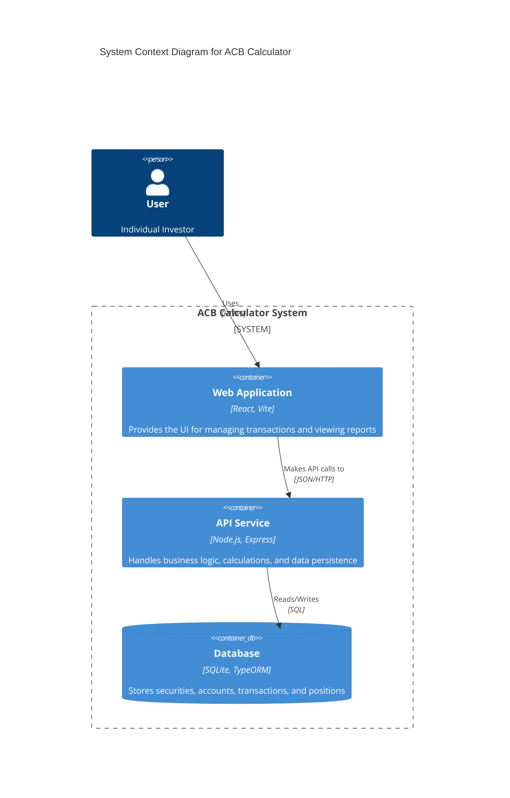
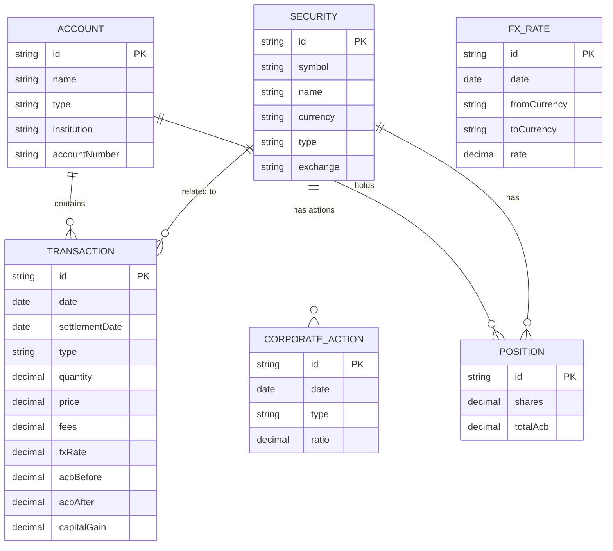
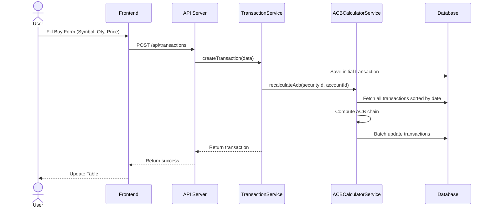
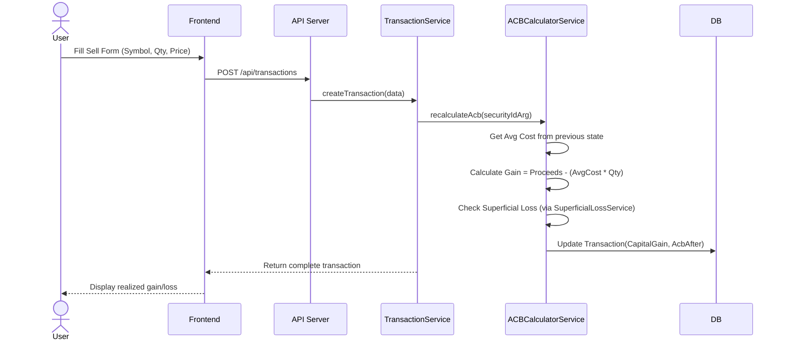
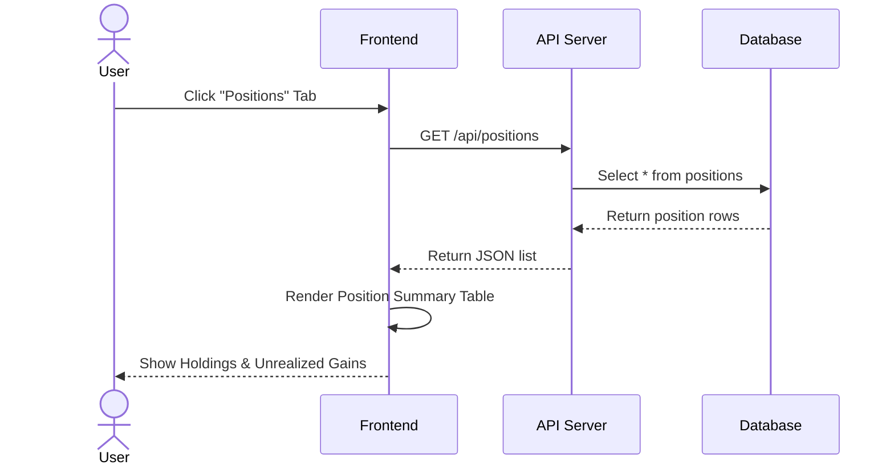

# Technical Design Document: Adjusted Cost Base (ACB) Calculator

## 1. System Architecture Overview
The ACB Calculator is a full-stack web application designed to track investment transactions and calculate Adjusted Cost Base (ACB) for Canadian tax purposes. It uses a **Client-Server** architecture where a React frontend communicates with a Node.js/Express backend via a RESTful API. The backend persists data to a local SQLite database using an ORM.

### High-Level Architecture (C4 Context)



## 2. Tech Stack & Infrastructure

### Frontend
-   **Language:** TypeScript
-   **Framework:** React 18
-   **Build Tool:** Vite
-   **State Management:** React Hooks (`useState`, `useEffect`, `useContext`)
-   **Styling:** CSS Modules / Standard CSS
-   **HTTP Client:** Native `fetch` API

### Backend
-   **Language:** TypeScript
-   **Runtime:** Node.js
-   **Framework:** Express
-   **ORM:** TypeORM
-   **Database:** SQLite (via `sql.js` / `sqlite3`)
-   **Math Library:** `decimal.js` (Crucial for financial precision)
-   **Testing:** Jest, ts-jest

### Infrastructure & Tools
-   **Package Manager:** npm
-   **Version Control:** Git
-   **Linting/Formatting:** ESLint, Prettier (implied)

## 3. Data Schema & Relational Model
The database is normalized and centers around the `Transaction` entity, which drives the `Position` calculations.

### Entity Relationship Diagram (ERD)



### Table Definitions

#### `securities`
| Field | Type | Description |
|---|---|---|
| `id` | VARCHAR(36) | Primary Key (UUID) |
| `symbol` | VARCHAR(20) | Ticker symbol (e.g., RY.TO) |
| `name` | VARCHAR(255) | Full name of the security |
| `currency` | VARCHAR(3) | Trading currency (default CAD) |
| `type` | VARCHAR(20) | Type: stock, etf, bond, etc. |

#### `accounts`
| Field | Type | Description |
|---|---|---|
| `id` | VARCHAR(36) | Primary Key (UUID) |
| `name` | VARCHAR(100) | User-defined name (e.g., "Questrade TFSA") |
| `type` | VARCHAR(20) | Registered status (TFSA, RRSP, Non-Reg) |

#### `transactions`
| Field | Type | Description |
|---|---|---|
| `id` | VARCHAR(36) | Primary Key (UUID) |
| `date` | DATE | Trade date |
| `type` | VARCHAR(20) | buy, sell, dividend, etc. |
| `securityId` | FK | Reference to Security |
| `accountId` | FK | Reference to Account |
| `quantity` | DECIMAL(15,6) | Number of shares |
| `price` | DECIMAL(15,4) | Price per share |
| `acbAfter` | DECIMAL(15,2) | Calculated running ACB |

#### `positions`
| Field | Type | Description |
|---|---|---|
| `id` | VARCHAR(36) | Primary Key (UUID) |
| `securityId` | FK | Reference to Security |
| `accountId` | FK | Reference to Account |
| `shares` | DECIMAL(15,6) | Current quantity held |
| `totalAcb` | DECIMAL(15,2) | Total Book Value |

## 4. API Surface & Contracts

### Transactions API
-   `GET /api/transactions`
    -   **Query Params**: `securityId`, `accountId`
    -   **Response**: `Transaction[]`
-   `GET /api/transactions/:id`
    -   **Response**: `Transaction`
-   `POST /api/transactions`
    -   **Body**: `{ date, type, securityId, accountId, quantity, price, ... }`
    -   **Response**: Created `Transaction`
-   `PUT /api/transactions/:id`
    -   **Body**: Partial transaction fields
    -   **Response**: Updated `Transaction`
-   `DELETE /api/transactions/:id`
    -   **Response**: 204 No Content

### Securities API
-   `GET /api/securities`
-   `POST /api/securities`
-   `DELETE /api/securities/:id`

### Accounts API
-   `GET /api/accounts`
-   `POST /api/accounts`
-   `DELETE /api/accounts/:id`

### Positions API
-   `GET /api/positions`
    -   **Response**: List of current holdings with ACB

### FX Rates API
-   `GET /api/fx-rates`

## 5. Backend Service Logic

### `TransactionService`
Facilitates CRUD operations and orchestrates the calculation flow.
-   **Role**: Entry point for transaction manipulation.
-   **Key Logic**: When a transaction is created, updated, or deleted, it triggers `ACBCalculatorService` to re-process the chain of transactions for that security.

### `ACBCalculatorService`
The core engine for determining tax implications.
-   **Role**: Iterates through transactions chronologically to compute `acbBefore`, `acbAfter`, and `capitalGain`.
-   **Logic**:
    -   **Buy**: Increases Total ACB.
    -   **Sell**: Decreases Total ACB by proportion of shares sold. Calculates Capital Gain = (Proceeds - transaction costs) - (Avg Cost * Shares Sold).
    -   **ROC (Return of Capital)**: Reduces ACB without changing share count.

### `SuperficialLossService`
Handles the complex "Superficial Loss" rule (Canada's wash sale rule).
-   **Role**: Detects if a loss is denied because the same security was purchased 30 days before or after the settlement date.
-   **Logic**:
    -   Scans for matching buys within the 61-day window.
    -   If found, adds the denied loss to the ACB of the substituted property.

### `FXRateService`
-   **Role**: Provides exchange rates for foreign securities.
-   **Logic**: Lookups up `FXRate` entity. Used to convert USD trades to CAD for valid CRA reporting.

## 6. Frontend Module Architecture
The frontend is a Single Page Application (SPA).

### Directory Structure
```
frontend/
├── src/
│   ├── components/      # Reusable UI components
│   │   ├── TransactionForm.tsx  # Add/Edit transactions
│   │   ├── TransactionTable.tsx # Data grid with filtering
│   │   ├── PositionSummary.tsx  # Portfolio dashboard
│   │   └── SetupPanel.tsx       # Manage Accounts/Securities
│   ├── services/        # API client modules
│   │   └── api.ts       # Centralized fetch wrappers (Axios/Fetch)
│   ├── styles/          # CSS files
│   ├── App.tsx          # Main Layout & State Container
│   └── main.tsx         # Entry point
```

### State Management
-   **Local State**: `App.tsx` holds the master state for `securities`, `accounts`, `transactions`, and `positions`.
-   **Data Flow**: Data is fetched on mount in `App.tsx` and passed down as props to `TransactionTable`, `PositionSummary`, etc.
-   **Updates**: Handler functions (`handleAddTransaction`, etc.) in `App.tsx` call the API service and then update the local state (optimistically or by re-fetching).

## 7. Core User Flows

### Flow 1: Adding a Buy Transaction
The user manually enters a trade. The system calculates the new Average Cost.



### Flow 2: Selling a Security (Capital Gain Calculation)
The user sells shares. The system determines the cost basis to calculate gain/loss.



### Flow 3: Viewing Portfolio Positions
User wants to see their current holdings and book value.


